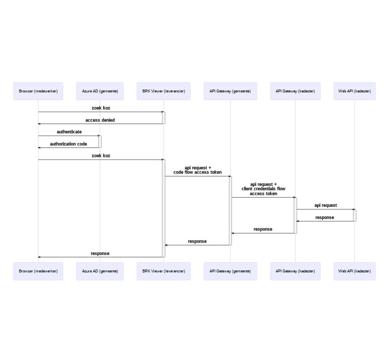
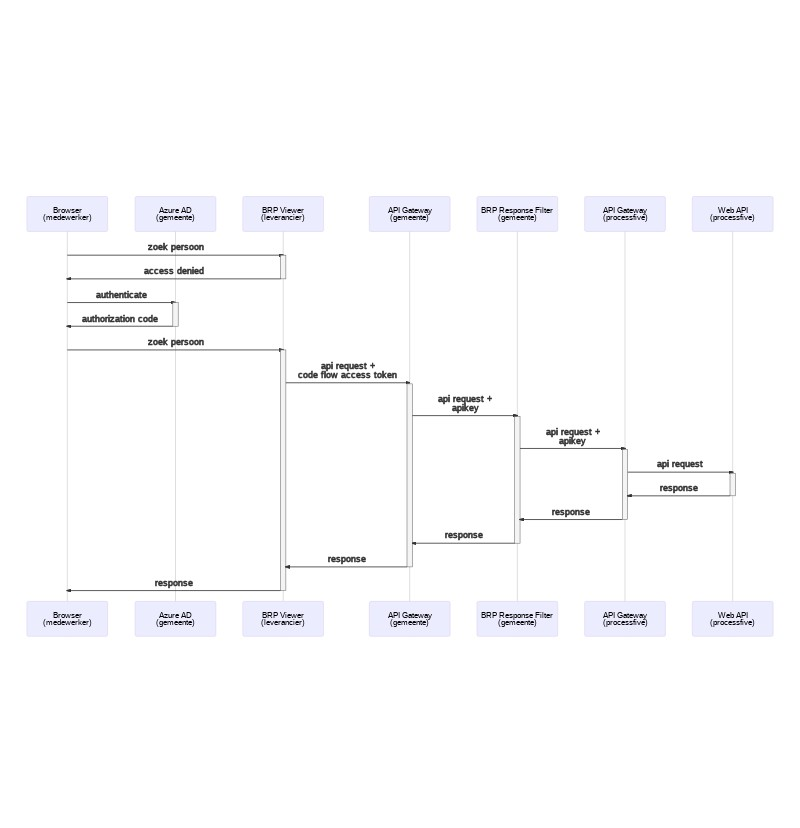

# Use case Applicatie leverancier wordt in de cloud gehost

Gemeente wil gebruik maken van een applicatie die wordt gehost in de cloud. Deze applicatie maakt gebruik van een Haal Centraal API.

## Gemeente doet authenticatie en autorisatie

- WebApp Leverancier gebruikt IdP van gemeente om medewerkers te authenticeren
- API Gateway gemeente biedt proxy van de Haal Centraal API die wordt aangeroepen door WebApp Leverancier
- API Gateway gemeente routeert de API aanroep naar de Haal Centraal API

Voordelen:

- Protocollering wordt door de gemeente zelf gedaan
- Authenticatie en authorisatie tussen API provider en Gemeente kan met dubbelzijdig TLS + api key blijven of met client credentials flow

Uitzoeken:

- Hoe zorgen we ervoor dat een leverancier niet zelf de url van de proxy API's bij gemeenten hoeft te beheren in de cloud applicatie. Kan het mee als claim? Of via een discovery service?

### Routeer rechtstreeks naar Haal Centraal API van de landelijke voorziening

### Routeer rechtstreeks via een intermediate bij gemeente naar Haal Centraal API van de landelijke voorziening

