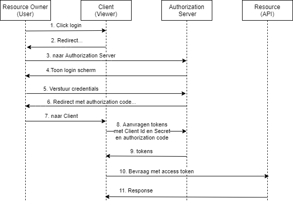
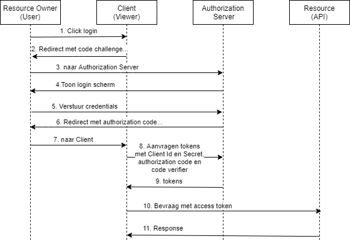

## Wat is OAuth 2

Volgens [RFC 6749](https://tools.ietf.org/html/rfc6749) is OAuth 2 een **Autorisatie** framework waarmee 3rd-party applicaties beperkt toegang kunnen verkrijgen voor een HTTP service:

- namens zichzelf
- namens een user

In OAuth 2 zijn vier rollen gedefinieerd:

- Resource (API)
- Client (applicatie)
- Resource Owner (gebruiker)
- Authorization Server

Verder zijn in OAuth 2 grant types / flows gedefinieerd waarmee een *Client* toegang vraagt voor een *Resource* bij de *Authorization Server*. Wanneer er sprake is van interactie tussen *Resource Owner* en *Client* (UI), dan zijn de *Authorization Code* flow (voor server-side web apps) en de *Implicit* flow (voor client-side web apps en native apps) de aanbevolen flows. Is er geen gebruiker interactie tussen de *Client* en *Resource Owner* (bijv. machine to machine, batch), dan is de *Client Credential* flow de aanbevolen flow. Echter, vanaf OAuth 2.1 is de *Implicit* flow niet meer de aanbevolen flow voor client-side web apps en native apps. Voor alle *Clients* waar er sprake is van gebruiker interactie is *Authorization Code flow met PKCE (Proof Key for Code Exchange)* de aanbevolen flow.

Een *Client* vraagt toegang tot een *Resource* door middel van *scopes*. Als een *Client* de *Authorization Server* om een access token vraagt, dan moet hij aangeven voor welke *scopes* hij de access token wil gebruiken. Met deze access token bevraagt de client dan een *Resource*, die de access token valideert op de vereiste *scopes*.

Belangrijk:

- Als OAuth wordt gebruikt als security protocol, dan moet de communicatie tussen de OAuth rollen worden beveildigd met TLS (SSL)
- OAuth is een autorisatie framework. Als alleen OAuth wordt gebruikt, dan weet de *Client* en *Resource* niet wie de *Resource Owner* is. Wil de *Client* en/of *Resource* weten wie de *Resource Owner* is, dan moet gebruik worden gemaakt van OpenID Connect.

## Wat is OpenID Connect

Volgens de OpenID Foundation is [OpenID Connect](https://openid.net/connect/) een extensie van OAuth 2 waarmee een *Client* informatie over de ingelogde *Resource Owner* kan opvragen. Een *Client* geeft met behulp van *identity scopes* op welke identiteit gegevens (claims) hij van een *Resource Owner* wil opvragen. Hieronder is een overzicht van de standaard OpenID *scopes* en *claims*:

| scope | claims | omschrijving |
| --- | --- | --- |
| openid | sub | id van het subject |
| profile | name, family_name, given_name, middle_name, nickname, preferred_username, profile, picture, website, gender, birthdate, zoneinfo, locale, and updated_at |
| email | email, email_verified |
| address| address |
| phone | phone_number, phone_number_verified |
| offline_access | | Met deze scope geeft de client aan dat hij gebruik wil maken van refresh tokens |

## Client Credential flow

## Authorization Code flow

## Authorization Code flow + Proof Key for Code Exchange (PKCE)

Extra toevoegingen t.o.v. Authorization Code flow:

- In stap 2 genereert de Client een **Code Challenge** en die wordt met de redirect meegestuurd naar de Authorization Server. De Authorization Server bewaart tijdelijk deze challenge zodat het in een vervolgstap kan worden gebruikt
- In stap 8 stuurt de Client de **Code Verifier** waarmee de **Code Challenge** in stap 2 is gegenereerd samen met zijn Client ID en Secret en de authorization code naar de Authorization Server. De Authorization Server genereert met deze **Code Verifier** een nieuwe **Code Challenge** en als deze gelijk is aan de **Code Challenge** uit stap 2, dan wordt een access token en eventueel een id token naar de client gestuurd.
