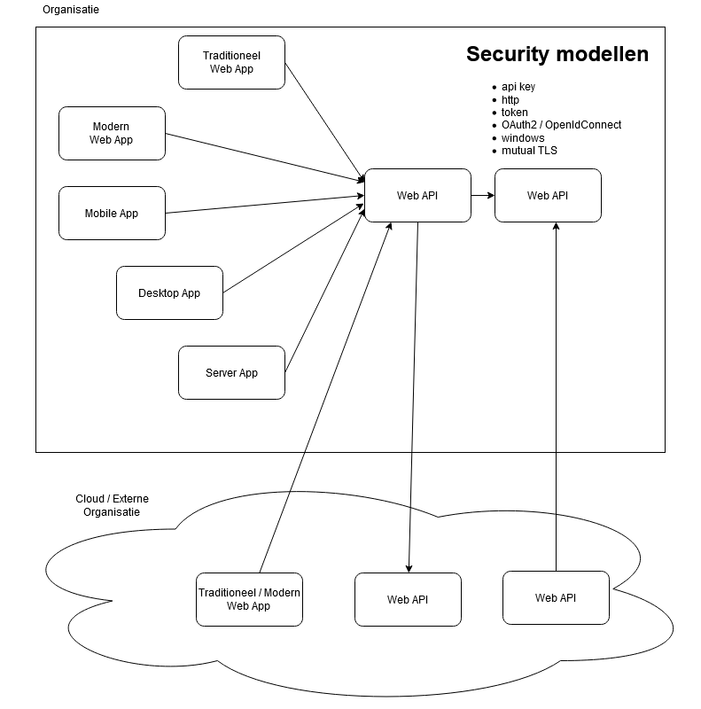
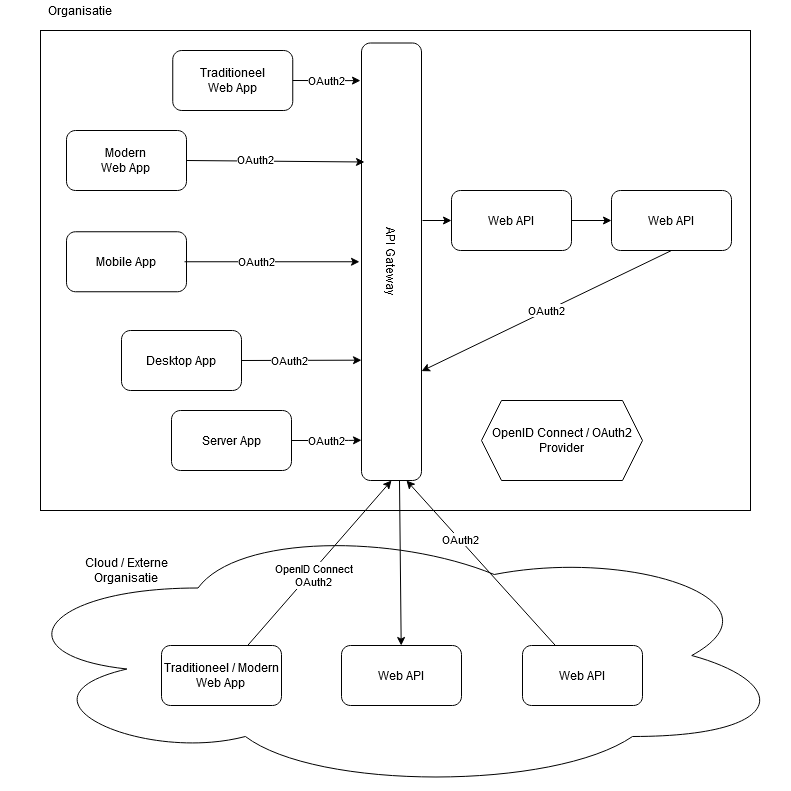

# Security Landschap

## Huidig

- Verschillende security modellen
- Grofmazig tot fijnmazige autorisatie
- Meerdere identity stores

## Gewenst / Toekomstig

- Eén security model (OpenID Connect en OAuth2) aan de randen
- Grofmazig tot fijnmazige autorisatie mogelijk
- Eén centrale identity store

